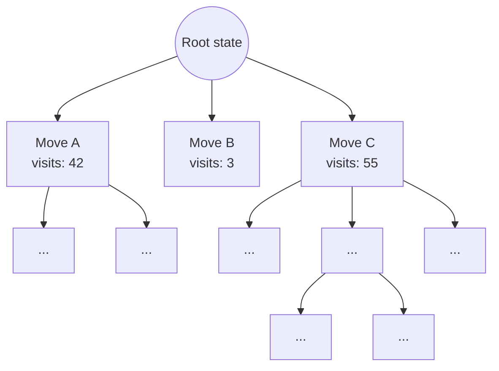

## Abstract

Monte Carlo Tree Search (MCTS) is a best-first search algorithm that builds a game tree incrementally and asymmetrically by using the outcomes of randomized simulations to guide exploration. Since its formalization by Kocsis and Szepesvári in 2006 (the UCT algorithm) and Coulom in 2006, MCTS has become the backbone of state-of-the-art decision-making systems — most famously powering DeepMind's AlphaGo, AlphaZero, and MuZero. Unlike classical search methods such as minimax with alpha-beta pruning, MCTS requires no domain-specific heuristic evaluation function and scales gracefully to enormous state spaces. This article develops MCTS from first principles: we begin with an intuitive, descriptive account of the algorithm, then formalize it mathematically through the lens of the multi-armed bandit problem, derive the UCT selection rule, and conclude with a fully worked Python implementation applied to a canonical game.

## 1. Introduction

### 1.1 The Problem with Traditional Tree Search

Consider a two-player, zero-sum game like chess or Go. In principle, optimal play can be computed by exhaustively expanding the game tree and applying **minimax**: propagate outcomes from terminal states back to the root, assuming each player plays optimally. In practice, this is computationally infeasible. The branching factor of chess is roughly 35; for Go, it is roughly 250. A full-depth search is combinatorially impossible — the game tree of Go alone is estimated to contain more states than atoms in the observable universe.

Classical engines address this with two techniques:

1. **Alpha-beta pruning** — eliminate branches that cannot influence the final decision.
2. **Heuristic evaluation functions** — cut the search short at a fixed depth and estimate the value of non-terminal positions using hand-crafted domain knowledge (piece values, king safety, mobility, and so on).

Both techniques share a critical weakness: they depend on a good evaluation function. For games like Go, where positional value is notoriously difficult to hand-encode, this approach historically produced weak play. This gap motivated a fundamentally different strategy — one that does not require an evaluation function at all.

### 1.2 Enter Monte Carlo Tree Search

MCTS sidesteps the need for hand-crafted heuristics by asking a simpler question: *if I play out this game randomly (or semi-randomly) to the very end many times, which early moves tend to lead to wins?*

Rather than evaluating a position by static features, MCTS evaluates it empirically, through repeated random simulation — a **Monte Carlo estimate** of its value. The word "tree search" refers to the fact that this estimation process is not applied uniformly; it is focused, iteration by iteration, on the parts of the tree that appear most promising, while still reserving some effort to double-check parts of the tree that look weak but are underexplored. This is the essence of the algorithm, and it is precisely why MCTS is often described as balancing **exploitation** (focusing effort where results have been good) against **exploration** (checking whether under-sampled options might secretly be better).


## 2. An Intuitive, Descriptive Overview

### 2.1 The Core Idea

Imagine you are trying to decide which of several restaurants to recommend to a friend, but you've only eaten at each restaurant a handful of times. If Restaurant A has been great in 9 out of 10 visits, and Restaurant B has only been visited once but was also great, how should you allocate your next few dinners to build confidence in your recommendation?

- You lean toward Restaurant A because it has a strong track record (**exploitation**).
- But you also want to try Restaurant B a few more times, because one data point isn't enough to trust (**exploration**).

MCTS applies exactly this logic to searching a decision tree. Each node in the tree is like a "restaurant" — an action or a game state — and each simulation played out from that node is like a "visit." Over many iterations, the algorithm allocates more simulations to promising branches while still sampling uncertain ones, gradually converging its attention on the strongest lines of play.

### 2.2 Why "Monte Carlo"?

The term *Monte Carlo method* refers broadly to algorithms that use repeated random sampling to obtain numerical estimates of quantities that are difficult to compute exactly — named after the famous casino, evoking the role of chance. In MCTS, the random sampling takes the form of **rollouts** (also called *playouts*): fast simulations of the game from a given position, following random or lightly-guided move choices, all the way to a terminal state. The outcome of many rollouts — win, loss, or draw — is averaged to produce a value estimate for the position from which they began.

### 2.3 What Makes the Tree "Asymmetric"

A defining visual signature of MCTS, when compared to a uniform-depth minimax tree, is that its search tree grows **asymmetrically**. Highly promising lines are expanded deeply, while clearly weak lines remain shallow or unexplored. This is a direct consequence of the exploration–exploitation balance: computational effort is a scarce resource, and MCTS spends it where it is expected to matter most.



Notice how Move C, having accumulated the most visits and presumably the best results, has been expanded further down the tree than Move B, which has been visited only a handful of times.


## 3. The Anatomy of MCTS: Four Phases

Every iteration of MCTS consists of four well-defined phases, executed in sequence and repeated until a computational budget (time, memory, or number of iterations) is exhausted.

| Phase | Purpose | Key Question Answered |
|---|---|---|
| **1. Selection** | Traverse the existing tree | "Given what we know so far, which path looks most worth investigating?" |
| **2. Expansion** | Grow the tree by one node | "What new position should we add to our knowledge base?" |
| **3. Simulation** | Estimate the value of the new node | "If we play randomly from here, who tends to win?" |
| **4. Backpropagation** | Update statistics along the path | "How should this new evidence update our beliefs about every ancestor decision?" |

### 3.1 Selection

Starting at the root, the algorithm recursively selects child nodes using a **tree policy** until it reaches a node that is either terminal or not yet fully expanded (i.e., has unexplored children). The tree policy is where the exploration–exploitation trade-off is made mathematically precise, typically via the **UCT formula**, which we derive rigorously in Section 4.

### 3.2 Expansion

Once selection reaches a node with unvisited children, one (or more) of those children is added to the tree as a new node, initialized with zero visits and zero accumulated reward.

### 3.3 Simulation (Rollout)

From the newly expanded node, the algorithm plays out the game to completion using a **default policy** — classically, uniformly random moves, though modern systems (like AlphaZero) replace this with a learned policy network. The terminal outcome (e.g., +1 for a win, 0 for a draw, −1 for a loss) is recorded.

### 3.4 Backpropagation

The simulation result is propagated back up the path taken during selection, updating the visit count and cumulative reward of every node along the way. This is what allows early decisions in the tree to benefit from evidence gathered deep within it.


After the iteration budget is exhausted, the algorithm typically recommends the child of the root with the **highest visit count** (not necessarily the highest average reward — visit count is a more robust indicator, since it reflects sustained confidence rather than a lucky sample) as the move to actually play.


## 4. Mathematical Foundations

This is where MCTS moves from metaphor to formalism. The central mathematical object underlying the selection phase is the **multi-armed bandit problem**.

### 4.1 The Multi-Armed Bandit Problem

Imagine a gambler facing $K$ slot machines ("one-armed bandits"), each with an unknown, fixed probability distribution of payouts. The gambler has a fixed number of pulls $n$ and wishes to maximize total reward. This requires balancing:

- **Exploitation** — pulling the arm with the highest observed average payout so far.
- **Exploration** — pulling less-tried arms to reduce uncertainty about their true payout.

Formally, let arm $i$ have unknown mean reward $\mu_i$, and let $\mu^* = \max_i \mu_i$. The **regret** after $n$ pulls is defined as:

$$
R_n = n\mu^* - \sum_{t=1}^{n} \mu_{I_t}
$$

where $I_t$ is the arm chosen at time $t$. A good bandit algorithm keeps $R_n$ as small as possible — ideally growing only logarithmically in $n$.

### 4.2 Upper Confidence Bounds (UCB1)

Auer, Cesa-Bianchi, and Fischer (2002) proposed the **UCB1** algorithm, which selects the arm maximizing:

$$
\text{UCB1}(i) = \bar{X}_i + C \sqrt{\frac{\ln n}{n_i}}
$$

where:

- $\bar{X}_i$ is the average observed reward from arm $i$ so far (the **exploitation term**),
- $n_i$ is the number of times arm $i$ has been pulled,
- $n = \sum_i n_i$ is the total number of pulls across all arms,
- $C$ is a constant controlling the exploration–exploitation balance (theoretically $C = \sqrt{2}$ for rewards bounded in $[0,1]$, though it is often tuned empirically).

**Interpreting the formula:** the second term grows with $\ln n$ (encouraging exploration as time passes) but shrinks with $n_i$ (discouraging further exploration of an arm once it has been tried many times). This term can be understood as an upper confidence bound on $\mu_i$ derived from a Chernoff–Hoeffding concentration inequality: with high probability, the true mean $\mu_i$ lies below $\bar{X}_i + C\sqrt{\ln n / n_i}$. Selecting the arm with the highest *upper bound* is therefore an "optimism in the face of uncertainty" strategy — it never permanently gives up on an arm, because that arm's confidence bound will keep widening (and its priority rising) the longer it is neglected.

UCB1 achieves an expected regret bound of:

$$
\mathbb{E}[R_n] \leq 8 \sum_{i:\mu_i < \mu^*} \frac{\ln n}{\Delta_i} + \left(1 + \frac{\pi^2}{3}\right)\sum_{i:\mu_i<\mu^*}\Delta_i
$$

where $\Delta_i = \mu^* - \mu_i$ is the sub-optimality gap of arm $i$. This logarithmic regret bound is, up to constants, asymptotically optimal — no algorithm can do fundamentally better in the worst case (Lai & Robbins, 1985).

### 4.3 From UCB1 to UCT

Kocsis and Szepesvári's key insight (2006) was that **each node in a game tree can be treated as a separate multi-armed bandit problem**, where the "arms" are the legal actions from that state. Applying UCB1 recursively at every node of the tree gives rise to the **UCT algorithm** — *Upper Confidence bounds applied to Trees*.

The UCT selection formula for choosing a child $j$ of node $v$ is:

$$
j^{*} = \underset{j \in \text{children}(v)}{\arg\max} \left[ \frac{w_j}{n_j} + C \sqrt{\frac{\ln N_v}{n_j}} \right]
$$

where:

- $w_j$ = total accumulated reward from simulations that passed through child $j$,
- $n_j$ = number of times child $j$ has been visited,
- $N_v$ = number of times the parent node $v$ has been visited ($N_v = \sum_j n_j$),
- $C$ = exploration constant (commonly $\sqrt{2}$, though tuned per domain).

The first term, $\frac{w_j}{n_j}$, is the empirical win rate of that branch — the exploitation component. The second term rewards branches that have been visited less often relative to their siblings — the exploration component. As $n_j \to \infty$ relative to its siblings, the exploration term vanishes and the formula converges toward pure exploitation, which is the desired asymptotic behavior of a consistent estimator.

> **A note on convention:** rewards are usually tracked from the perspective of the player *to move at the parent node*, since in adversarial games a win for one player is a loss for the other. This requires flipping the sign of $w_j$ (or equivalently, of the reward) at every other tree level — a subtlety that is easy to overlook but essential to implement correctly (see Section 6).

### 4.4 Convergence Guarantees

A crucial theoretical result from Kocsis and Szepesvári is that **UCT converges to the minimax solution** as the number of simulations grows. Specifically, the probability of selecting a suboptimal action at the root converges to zero at a rate of $O(1/n)$, and the expected error of the value estimate at the root decays at a rate of $O(\ln n / n)$. This gives MCTS a theoretical grounding not present in earlier "flat" Monte Carlo game-playing methods, which sampled every root move equally rather than focusing computation adaptively.

It's worth being precise about what this guarantee does and does not say: convergence is asymptotic. For finite computational budgets — which is the practical regime MCTS always operates in — there is no guarantee of finding the true optimal move, only that the search's bias toward better lines *compounds* correctly as more simulations are spent.

### 4.5 Complexity Considerations

Each MCTS iteration costs $O(d)$ for selection and backpropagation, where $d$ is the depth reached, plus the cost of one rollout to a terminal state. Because MCTS is an **anytime algorithm** — it can be stopped at any point and still return a reasonable answer, with quality improving monotonically as more time is given — it is exceptionally well suited to real-time or resource-constrained decision-making, unlike minimax, which requires completing an entire depth level to produce a usable result.


## 5. The Algorithm, Formally

Below is MCTS expressed as structured pseudocode, integrating the four phases and the UCT formula derived above.

```
function MCTS(root_state, iterations):
    root ← Node(state = root_state, parent = None)

    for i in 1 .. iterations:
        node ← root

        # --- 1. Selection ---
        while node is fully expanded and node is not terminal:
            node ← SelectChildUCT(node)

        # --- 2. Expansion ---
        if node is not terminal:
            node ← ExpandOneChild(node)

        # --- 3. Simulation ---
        result ← RolloutSimulation(node.state)

        # --- 4. Backpropagation ---
        while node is not None:
            node.visits ← node.visits + 1
            node.reward ← node.reward + PerspectiveAdjust(result, node)
            node ← node.parent

    return BestChild(root, criterion = "most visited").action


function SelectChildUCT(node):
    return argmax over child c of node:
        (c.reward / c.visits) + C * sqrt( ln(node.visits) / c.visits )
```


## 6. Implementation: MCTS in Python

To ground the theory, we implement MCTS from scratch and apply it to **Tic-Tac-Toe** — small enough to verify correctness by hand, yet rich enough to exhibit genuine tree search behavior.

### 6.1 The Game State

```python
import math
import random
from copy import deepcopy

class TicTacToe:
    """A minimal Tic-Tac-Toe environment. Board cells: 0=empty, 1=X, -1=O."""

    def __init__(self):
        self.board = [0] * 9
        self.player = 1  # 1 = X to move, -1 = O to move

    def legal_actions(self):
        return [i for i, v in enumerate(self.board) if v == 0]

    def apply_action(self, action):
        new_state = deepcopy(self)
        new_state.board[action] = self.player
        new_state.player = -self.player
        return new_state

    def is_terminal(self):
        return self.winner() is not None or not self.legal_actions()

    def winner(self):
        lines = [(0,1,2),(3,4,5),(6,7,8),
                 (0,3,6),(1,4,7),(2,5,8),
                 (0,4,8),(2,4,6)]
        for a, b, c in lines:
            s = self.board[a] + self.board[b] + self.board[c]
            if s == 3:
                return 1
            if s == -3:
                return -1
        return None
```

### 6.2 The Tree Node

```python
class Node:
    def __init__(self, state, parent=None, action_taken=None):
        self.state = state
        self.parent = parent
        self.action_taken = action_taken     # action that produced this node
        self.children = {}                   # action -> Node
        self.visits = 0
        self.total_reward = 0.0
        self.untried_actions = state.legal_actions()

    def is_fully_expanded(self):
        return len(self.untried_actions) == 0

    def uct_value(self, C=math.sqrt(2)):
        if self.visits == 0:
            return float("inf")  # force-visit unexplored nodes first
        exploitation = self.total_reward / self.visits
        exploration = C * math.sqrt(math.log(self.parent.visits) / self.visits)
        return exploitation + exploration
```

### 6.3 The Four Phases, Implemented

```python
def select(node):
    """Descend the tree via UCT until a non-fully-expanded or terminal node."""
    while node.is_fully_expanded() and not node.state.is_terminal():
        node = max(node.children.values(), key=lambda n: n.uct_value())
    return node

def expand(node):
    """Add one new child for an untried action."""
    if node.state.is_terminal():
        return node
    action = node.untried_actions.pop()
    child_state = node.state.apply_action(action)
    child = Node(child_state, parent=node, action_taken=action)
    node.children[action] = child
    return child

def simulate(state, root_player):
    """Play uniformly random moves to a terminal state; return reward for root_player."""
    current = state
    while not current.is_terminal():
        action = random.choice(current.legal_actions())
        current = current.apply_action(action)
    winner = current.winner()
    if winner is None:
        return 0.0
    return 1.0 if winner == root_player else -1.0

def backpropagate(node, reward, root_player):
    """Propagate the simulation result, flipping sign for the opposing player."""
    while node is not None:
        node.visits += 1
        # reward is always stored from root_player's perspective
        node.total_reward += reward
        node = node.parent
```

### 6.4 Tying It Together

```python
def mcts(root_state, iterations=2000, C=math.sqrt(2)):
    root = Node(root_state)
    root_player = root_state.player

    for _ in range(iterations):
        node = select(root)
        node = expand(node)
        reward = simulate(node.state, root_player)
        backpropagate(node, reward, root_player)

    # choose the most-visited child — the robust choice, not the highest average
    best_action = max(root.children.items(), key=lambda kv: kv[1].visits)[0]
    return best_action
```

### 6.5 Running It

```python
if __name__ == "__main__":
    game = TicTacToe()
    while not game.is_terminal():
        if game.player == 1:
            move = mcts(game, iterations=1500)
        else:
            move = random.choice(game.legal_actions())
        game = game.apply_action(move)
        print(game.board[0:3])
        print(game.board[3:6])
        print(game.board[6:9])
        print("---")

    result = game.winner()
    print("Winner:", {1: "X (MCTS)", -1: "O (random)", None: "Draw"}[result])
```

Running this against a purely random opponent, the MCTS-driven player reliably wins or draws — never loses — which is exactly the behavior we'd expect: 1,500 simulations per move is more than sufficient to solve a game as small as Tic-Tac-Toe near-optimally, consistent with the convergence guarantee discussed in Section 4.4.

> **A worthwhile exercise:** try setting `C = 0`. You'll observe the algorithm collapsing into pure greedy exploitation — it will lock onto whichever first move got lucky early on and never revisit that decision, illustrating concretely why the exploration term is not optional.


## 7. Enhancements and Variants

Vanilla MCTS with random rollouts is a strong baseline, but modern systems layer significant refinements on top of it.

### 7.1 RAVE (Rapid Action Value Estimation)

RAVE shares statistics between nodes that correspond to the *same action*, regardless of where in the tree that action occurs, under the heuristic that a move's value is often only weakly dependent on move order (the "all-moves-as-first" heuristic). This dramatically accelerates early learning, at the cost of some bias, and is typically blended with standard UCT statistics via a decaying weight.

### 7.2 Progressive Widening

In domains with very large or continuous action spaces, expanding *all* children of a node is intractable. Progressive widening limits the number of children considered at a node to a slowly growing function of its visit count, e.g., $\lfloor n_v^{\alpha} \rfloor$ for some $\alpha \in (0,1)$, adding new actions only as confidence in existing ones accumulates.

### 7.3 PUCT: The AlphaZero Modification

AlphaZero replaces both the random rollout policy *and* the UCT formula itself. A single neural network $f_\theta(s) = (\mathbf{p}, v)$ outputs a policy prior $\mathbf{p}$ over moves and a scalar value estimate $v$ for state $s$, trained via self-play. The tree policy becomes:

$$
a^{*} = \underset{a}{\arg\max}\left[ Q(s,a) + c_{\text{puct}} \cdot P(s,a) \cdot \frac{\sqrt{\sum_b N(s,b)}}{1 + N(s,a)} \right]
$$

Here, $P(s,a)$ (the network's prior probability for move $a$) replaces the log-count exploration bonus, letting learned pattern recognition — rather than blind random rollouts — guide exploration. Critically, the **value network** $v$ replaces the need for a rollout to a terminal state entirely: leaf nodes are evaluated directly by $f_\theta$, making the search dramatically more sample-efficient, especially in domains where random rollouts are a poor proxy for skilled play (as in Go).

### 7.4 Parallelization

Because rollouts are independent given a fixed tree, MCTS parallelizes naturally. Three common strategies are:

| Strategy | Description | Trade-off |
|---|---|---|
| **Leaf parallelization** | Run multiple rollouts from the same expanded leaf simultaneously | Simple, but wastes effort on a single node |
| **Root parallelization** | Run independent MCTS trees on separate threads, merge statistics at the end | Embarrassingly parallel, no synchronization overhead during search |
| **Tree parallelization** | Multiple threads traverse and update a single shared tree | Highest efficiency, but requires locking or virtual-loss techniques to avoid collisions |


## 8. Applications Beyond Games

While MCTS rose to fame through board games, its core idea — using sampled rollouts to estimate the value of a decision under an intractably large branching structure — generalizes well beyond games:

- **Real-time strategy games and general game playing** (e.g., General Game Playing competitions, where no domain-specific heuristics can be hand-coded in advance).
- **Combinatorial optimization**, such as scheduling and the traveling salesman problem, where MCTS explores partial solutions.
- **Robotic motion planning**, treating candidate action sequences as tree branches.
- **Neural architecture search**, where MCTS explores the space of possible network configurations.
- **Chemical synthesis planning**, exploring reaction pathways toward a target molecule.


## 9. Limitations and Open Challenges

No method is a free lunch. MCTS has well-known weaknesses:

1. **Sensitivity to rollout quality.** Purely random rollouts can be a poor proxy for skilled play in tactically sharp domains, leading to misleading value estimates unless mitigated by learned policies (as in AlphaZero) or domain-specific rollout heuristics.
2. **Trap states / shallow traps.** MCTS can be fooled by positions that look statistically fine over many random rollouts but contain a single precise refutation — a known weakness in domains with narrow forcing sequences.
3. **Exploration constant tuning.** The value of $C$ is domain-sensitive; a poor choice leads to either premature convergence on a suboptimal move or wasted computation on clearly bad branches.
4. **Memory growth.** The tree can grow very large in long-horizon problems, necessitating pruning or node-recycling strategies.
5. **Non-stationary or stochastic environments** complicate both the reward model and the applicability of the UCB1-derived guarantees, which assume a fixed underlying reward distribution per arm.


## 10. Conclusion

Monte Carlo Tree Search represents a conceptual bridge between classical adversarial search and modern statistical decision theory. By reframing tree search as a nested sequence of multi-armed bandit problems, it inherits principled, theoretically-grounded exploration strategies (via UCB1/UCT) while remaining entirely free of the need for hand-engineered heuristic evaluation functions. Its anytime nature, natural parallelizability, and compatibility with learned policy and value functions have made it not just a historical curiosity but a foundational component of the most capable decision-making systems built to date — from Go-playing agents to protein-folding pipelines. Understanding MCTS deeply, from its bandit-theoretic roots to its practical implementation details like perspective-flipping in backpropagation, equips one to apply it confidently to genuinely novel domains far beyond the board games where it was born.


## References

- Kocsis, L., & Szepesvári, C. (2006). *Bandit based Monte-Carlo Planning*. ECML.
- Coulom, R. (2006). *Efficient Selectivity and Backup Operators in Monte-Carlo Tree Search*. Computers and Games.
- Auer, P., Cesa-Bianchi, N., & Fischer, P. (2002). *Finite-time Analysis of the Multiarmed Bandit Problem*. Machine Learning, 47(2-3), 235–256.
- Lai, T. L., & Robbins, H. (1985). *Asymptotically Efficient Adaptive Allocation Rules*. Advances in Applied Mathematics, 6(1), 4–22.
- Silver, D., et al. (2017). *Mastering the Game of Go without Human Knowledge*. Nature, 550, 354–359.
- Browne, C. B., et al. (2012). *A Survey of Monte Carlo Tree Search Methods*. IEEE Transactions on Computational Intelligence and AI in Games, 4(1), 1–43.